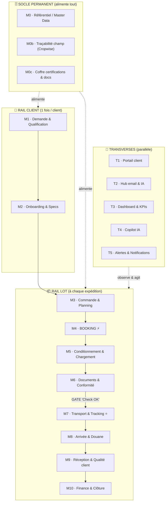

# Natural Kiss — Plateforme

Outil de suivi **production-export** (fruits & légumes) augmenté par l'IA, qui
couvre **tout le flux** de Natural Kiss — du **premier contact client** jusqu'au
**retour qualité et à la clôture financière** — construit **brique par brique**
autour d'un objet central : le **lot** (shipment / conteneur).

> **Contexte métier** : Natural Kiss est un producteur-exportateur égyptien de
> fruits & légumes vers l'Europe, le Royaume-Uni et la Russie (Tenderstem/Bimi
> pour Barfoots, patate douce, plants « slips », ail, fraise, projet mangue).
> L'outil répond à des **douleurs réelles** : incohérences documentaires,
> certificats phytosanitaires refaits en boucle, détentions douanières, rejets
> qualité, litiges financiers. Voir [`docs/`](#documents-de-conception).

---

## 1. Le principe directeur : tout gravite autour du LOT

Le point de départ de toute l'architecture : **le LOT (une expédition / un
conteneur) est l'objet central**, suivi sur tout son cycle de vie. Chaque
fonctionnalité vient s'accrocher à une **étape précise** de la chaîne.

L'ensemble s'organise en **4 strates** clairement séparées :

| Strate                 | Rôle                                                                                                 | Rythme                         |
| ---------------------- | ---------------------------------------------------------------------------------------------------- | ------------------------------ |
| 🗄️ **SOCLE permanent** | Données de référence (produits, clients, sites, certifications, traçabilité champ)                   | Toujours actif, alimente tout  |
| 👤 **RAIL CLIENT**     | Cycle de la _relation_ : demande → onboarding → espace client                                        | **1 fois par client**          |
| 📦 **RAIL LOT**        | Cycle de _l'expédition_ : booking → chargement → documents → transport → arrivée → qualité → clôture | **À chaque envoi**             |
| 🔁 **TRANSVERSES**     | Portail client, hub email/IA, dashboard, copilot, alertes                                            | En **parallèle**, tout le long |

> **Insight clé** : ne jamais mélanger le **niveau client** (rare : onboarder,
> certifier) et le **niveau lot** (permanent : suivre un conteneur). C'est cette
> séparation qui rend le système lisible.

---

## 2. Le flux complet (vue d'ensemble)



### Le verrou central : la « GATE Check OK » (entre M6 et M7)

Le point névralgique du système est un **jalon formel de validation** entre les
Documents/Conformité (M6) et le Transport (M7).

> **Règle d'or : rien ne part tant que Documents + Conformité + Preuve produit
> ne sont pas tous au vert.**

C'est ce verrou, augmenté par l'IA, qui évite les douleurs réelles : n° de
conteneur incohérent, factures « modifiées », certificats phytosanitaires
refaits en boucle, détentions douanières pour thrips/_Bemisia_. Quand la gate
passe au vert → **envoi automatique du mail** au client / broker.

---

## 3. Le parcours d'un lot, étape par étape

1. **Demande client (M1)** — un client demande un produit X vers un pays Y.
   Matching automatique des certifications (M0c) : si suffisant → envoi auto du
   pack ; sinon → alerte + workflow de correction.
2. **Onboarding (M2)** — la demande qualifiée devient un client actif ; création
   de son **espace portail** (T1).
3. **Planning (M3)** — la commande est planifiée semaine par semaine ; **import
   de l'Excel existant** ; comparaison **prévu vs réalisé**.
4. **Booking (M4) ⚡** — la **réservation de la ligne** est le déclencheur : elle
   **fait naître le lot** (n° de conteneur) suivi par tout le reste.
5. **Chargement (M5)** — QR / photo au chargement, **photo boîte** visible par le
   client, installation du datalogger, QC départ.
6. **Documents & Gate (M6)** — dépôt des documents, **vérificateur IA** de
   cohérence croisée, **checklist de conformité** pays/produit, puis **Gate**.
7. **Transport & Tracking (M7) ⭐** — **tout le voyage par n° de conteneur** :
   timeline, position (MarineTraffic / FlightRadar), courbes température/humidité
   (datalogger), **score de risque d'arrivée**.
8. **Arrivée & Douane (M8)** — dédouanement, validation CHED, livraison.
9. **Réception & Qualité (M9)** — **import automatique du PDF de retour** depuis
   les mails, **analyse IA** des défauts, comparaison photo départ ↔ arrivée,
   tendances par produit/client/site.
10. **Finance & Clôture (M10)** — statut de paiement, cohérence facture, litiges
    (cas Voltz), certificats de destruction.

En parallèle : le **portail client (T1)**, le **hub email/IA (T2)**, le
**dashboard (T3)**, le **copilot (T4)** et les **alertes (T5)** traversent tout
le flux.

---

## 4. Briques livrées (modules → implémentation)

La plateforme est construite en **tranches verticales** (UI → logique → données),
**mock-first** : chaque source externe (MarineTraffic, FlightRadar, Cropwise,
datalogger, email, LLM) est derrière un **adaptateur** avec une implémentation
mock réaliste, basculable vers le réel **sans réécrire la brique**.

| Brique                       | Modules          | Contenu                                                                                                            |
| ---------------------------- | ---------------- | ------------------------------------------------------------------------------------------------------------------ |
| **0 — Fondations**           | M0               | Socle de données Supabase, design system bilingue, adaptateurs mock, feature flags, tests, CI.                     |
| **1 — Tracking ⭐P0**        | M7               | Tout le voyage d'un conteneur par son numéro : timeline, carte, capteurs, score de risque.                         |
| **2 — Objet Lot**            | —                | Liste filtrable + fiche 360° (tracking, docs, qualité, origine).                                                   |
| **3 — Documents & Gate ⭐**  | M6               | Dépôt docs, **vérificateur IA** de cohérence, **checklist conformité**, **Gate « Check OK »** → mail auto au vert. |
| **4 — Chargement & Portail** | M5, T1           | Preuve produit (photo boîte / QR), portail client isolé par **RLS**.                                               |
| **5 — Dashboard & Planning** | T3, M3           | KPIs (taux de service / retard), planning prévu/réalisé, import Excel.                                             |
| **6 — Hub email & Qualité**  | T2, M9           | Import auto du PDF de retour, analyse IA des défauts, comparaison départ↔retour, tendances.                        |
| **7 — Demande & Onboarding** | M1, M2, M0c      | Matching auto des certifs, envoi auto ou alerte+correction, coffre certifs, création espace client.                |
| **8 — Complétude du flux**   | M0b, M10, T4, T5 | Connecteur Cropwise, finance (paiements/litiges), copilot IA, moteur d'alertes proactives.                         |
| **9 — Booking**              | M4               | Dossier de réservation en un clic + point d'entrée unique de confirmation qui **fait naître le lot**.              |

---

## 5. Documents de conception

Le dossier [`docs/`](docs/) contient les documents fondateurs (le _pourquoi_ et
le _comment_ du produit) :

| Document                                                                     | Contenu                                                                                                                                                              |
| ---------------------------------------------------------------------------- | -------------------------------------------------------------------------------------------------------------------------------------------------------------------- |
| [`docs/01-base-de-connaissance.md`](docs/01-base-de-connaissance.md)         | **Base de connaissance métier** : identité, produits, clients, chaîne logistique, qualité/conformité, douleurs réelles, chronologie. La matière première du produit. |
| [`docs/02-architecture-plateforme.md`](docs/02-architecture-plateforme.md)   | **Architecture modulaire** : les 4 strates, les modules M0→M10 & T1→T5, la Gate, les intégrations externes, la feuille de route.                                     |
| [`docs/03-strategie-implementation.md`](docs/03-strategie-implementation.md) | **Stratégie d'implémentation** : philosophie « tranches verticales, mock-first, à cliquet », stack, séquence des briques, stratégie de test, Definition of Done.     |

---

## 6. Stack

Next.js 16 (App Router) · TypeScript strict · Tailwind v4 + shadcn/ui · Supabase
(Postgres, Auth, Storage, RLS) via `supabase-js` typé · Zod · next-intl (FR/EN) ·
Vitest · Playwright.

## 7. Prérequis

- **Node 20.9+**
- **Docker** (pour Supabase en local)
- **Supabase CLI** (`brew install supabase/tap/supabase` ou https://supabase.com/docs/guides/cli)

## 8. Démarrage rapide (Supabase local)

```bash
npm install
cp .env.local.example .env.local        # valeurs locales (voir plus bas)
npm run db                              # démarre Supabase local (Docker)
npm run db:reset                        # applique migrations + seed + fichiers Storage
npm run types                           # régénère src/lib/supabase/types.ts
npm run dev                             # http://localhost:3000
```

Pour `.env.local` en local, renseignez les valeurs affichées par `supabase status`
(`API URL`, `anon key`, `service_role key`).

## 9. Brancher un projet Supabase **cloud**

Aucun changement de code : seule la configuration diffère.

1. Dans `.env.local`, mettez l'URL + les clés **du projet cloud**
   (`Project Settings → API`). La `service_role` key est un **secret serveur**.
2. Poussez le schéma vers le cloud :
   ```bash
   supabase link --project-ref <ref-du-projet>
   supabase db push                      # applique supabase/migrations/*
   ```
3. Types depuis le cloud :
   ```bash
   supabase gen types typescript --linked --schema public > src/lib/supabase/types.ts
   ```
4. Le seed (`supabase/seed.sql`) est destiné au **local** (`db reset`). En cloud,
   chargez les données de démo via une migration dédiée ou `psql`, puis
   `npm run seed` pour les fichiers Storage.
5. Pour les données de démo **Gate** (Brique 3 : métadonnées documentaires +
   pièces manquantes), un top-up idempotent via la service role est fourni :
   `node scripts/seed-gate.mjs` (aligné sur `supabase/seed.sql`).
6. Pour les données de démo **Demande & Onboarding** (Brique 7 : coffre M0c +
   demande « mangue → UK »), un top-up idempotent est fourni :
   `node scripts/seed-onboarding.mjs` (aligné sur `supabase/seed.sql`, inclus
   dans `npm run seed`).

## 10. Scripts npm

| Script                                  | Rôle                                                                               |
| --------------------------------------- | ---------------------------------------------------------------------------------- |
| `npm run dev`                           | Serveur de dev Next.js                                                             |
| `npm run build` / `start`               | Build & serveur de production                                                      |
| `npm run db`                            | `supabase start` (Supabase local)                                                  |
| `npm run db:reset`                      | `supabase db reset` (migrations + seed) puis `npm run seed`                        |
| `npm run db:push`                       | `supabase db push` (applique les migrations sur le **cloud** lié)                  |
| `npm run types`                         | Génère les types TS depuis le schéma **local**                                     |
| `npm run types:cloud`                   | Génère les types TS depuis le schéma **cloud** lié                                 |
| `npm run seed`                          | Pousse les fichiers de démo dans Storage + top-ups (portail, planning, onboarding) |
| `node scripts/seed-gate.mjs`            | Top-up idempotent des données de démo Gate (cloud, service role)                   |
| `node scripts/seed-onboarding.mjs`      | Top-up idempotent du coffre certifs + demande démo (Brique 7)                      |
| `node scripts/seed-booking.mjs`         | Top-up idempotent des dossiers de réservation démo (Brique 9)                      |
| `npm run lint` / `typecheck` / `format` | Qualité                                                                            |
| `npm test`                              | Tests unitaires + intégration (Vitest, Supabase local)                             |
| `npm run test:e2e`                      | Test E2E (Playwright)                                                              |

## 11. Architecture du code

```
src/
  app/                     # App Router : une route par module (tracking, lots, gate,
                           #   chargement, portail, dashboard, planning, qualite,
                           #   demande, finance, alertes, copilot, booking)
  components/              # design system + composants par module
  i18n/                    # next-intl (FR/EN, sans routing — locale via cookie)
  lib/
    adapters/              # interfaces + mocks (Tracking/Sensor/FieldTrace/Email/Llm/…)
    <module>/              # logique par module : rules.ts (pur, testable),
                           #   service.ts (accès données), actions.ts (server actions)
    supabase/              # clients (admin service-role, serveur, navigateur) + types
    feature-flags.ts       # activation par module/brique
    modules.ts             # registre des modules (M0→M10, T1→T5)
supabase/
  migrations/              # schéma versionné (0001 → 0009) + RLS + grants
  seed.sql                 # données de démo réalistes (dont cas « à problème »)
scripts/                   # seed Storage + top-ups cloud idempotents
tests/                     # unit · integration (Supabase local) · e2e (Playwright)
docs/                      # documents de conception (base de connaissance, archi, stratégie)
```

### Le socle de données (M0)

Tables autour du lot : `clients`, `commandes`, `lots`, `transporteurs`,
`origines`, `documents`, `evenements_timeline`, `mesures_capteur`,
`rapports_qualite`, `preuves_produit`, plus les tables des briques suivantes
(gate, planning, qualité, onboarding, finance, booking…). **RLS activée partout**
(deny par défaut) ; l'accès interne passe par la **service role** ; l'isolation
client du portail (Brique 4) repose sur `clients.portail_user_id` et la fonction
`public.current_client_id()`.

Buckets Storage : `documents`, `preuves`, `retours-qc`.

### Adaptateurs mock-first

Chaque source externe est derrière une interface, avec une implémentation `Mock`
par défaut (données calquées sur la base de connaissance) validée par Zod. Bascule
vers le réel via `NK_<SOURCE>_PROVIDER=real`, **sans toucher aux briques**.

| Adaptateur                                                   | Mock                    | Réel (quand prêt)             |
| ------------------------------------------------------------ | ----------------------- | ----------------------------- |
| `TrackingProvider`                                           | Route rejouée           | MarineTraffic / FlightRadar   |
| `SensorProvider`                                             | Séries simulées         | Datalogger SIM / API capteurs |
| `LlmProvider` / `QcAnalyzerProvider` / `DocVerifierProvider` | Réponses déterministes  | API LLM                       |
| `EmailProvider`                                              | Boîte fictive           | IMAP / API mail               |
| `FieldTraceProvider`                                         | Données champ fictives  | Cropwise                      |
| `BookingConfirmationProvider`                                | Extraction déterministe | LLM                           |

### i18n

FR (interne, défaut) + EN, via next-intl **sans routing** : la locale est stockée
dans un cookie et se change depuis l'en-tête. Aucune duplication de routes.

## 12. Tests & qualité

- **Unitaires (Vitest)** : logique métier pure (score de risque, cohérence
  documentaire, matching certifs, KPI retard, règles de gate…).
- **Intégration (Vitest + Supabase local)** : flux de données + règles **RLS**.
- **E2E (Playwright)** : un parcours par brique (le critère de démonstrabilité).
- **CI** : `lint + typecheck + format:check` puis tests sur Supabase local à
  chaque commit.

> **Definition of Done** d'une brique (cf.
> [`docs/03-strategie-implementation.md`](docs/03-strategie-implementation.md)) :
> fonctionnalité de bout en bout, adaptateurs mock, migration + RLS + types,
> `seed.sql` enrichi (dont cas « à problème »), tests unit + intégration + 1 E2E,
> feature flag, aucune régression.

## 13. Vérification manuelle

1. `npm run db` puis `npm run db:reset` → base peuplée (Supabase Studio local :
   http://127.0.0.1:54323).
2. `npm run dev` → la home liste les lots issus de Supabase (dont `CAAU4027760`,
   le lot rejeté `OLMP2605160`, le conteneur incohérent `OTPU6220580`).
3. `npm test` et `npm run test:e2e` → tout est vert.
