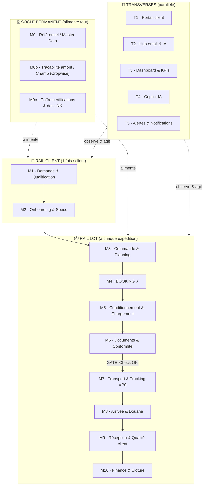

# Natural Kiss — Architecture de la plateforme (document de conception)

> **Objet** : formaliser, de manière détaillée et développée, l'architecture modulaire de l'outil à construire pour Natural Kiss.
> **Sources** : `NATURAL_KISS_Knowledge_Base.md` (compréhension métier & douleurs réelles) + notes de cadrage du 2ᵉ appel (retranscrites intégralement, chaque note rattachée à un module).
> **Nature** : document de conception / brainstorm structuré. **Aucune décision technique de code n'est figée ici.**
> **Objectif final** : un outil complet couvrant **tout le flux** de production-export de Natural Kiss, augmenté par l'IA, construit **pas à pas**.
> **Date** : 8 juillet 2026.

---

## 1. Vision & principe directeur

L'outil doit couvrir **l'intégralité de la chaîne de production-export** de Natural Kiss, du **premier contact client** jusqu'au **retour qualité et à la clôture financière**, en passant par l'onboarding, le chargement, le transport, l'arrivée et les papiers.

Le principe fondateur : **tout gravite autour d'un objet central, le LOT (conteneur / expédition)**, suivi sur tout son cycle de vie. Chaque module vient s'accrocher à une **étape précise** de la chaîne — certains en **série** (ils s'enchaînent), d'autres en **parallèle** (ils traversent tout), d'autres **à cheval** sur plusieurs étapes (ce sont des services, pas des étapes).

### 1.1 Les 4 strates de l'architecture

L'ensemble s'organise en **4 strates** clairement séparées :

1. **Le SOCLE permanent** — les données de référence (produits, clients, sites, certifications, traçabilité champ). Toujours actives, elles alimentent tout le reste.
2. **Le RAIL CLIENT** — le cycle de la _relation_ : contact → onboarding → espace client. Il se joue **une fois par client** (puis mises à jour ponctuelles).
3. **Le RAIL LOT** — le cycle de _l'expédition_ : commande → booking → chargement → documents → transport → arrivée → qualité → clôture. Il se rejoue **à chaque envoi**.
4. **Les couches TRANSVERSES** — portail client, hub email/IA, dashboard, copilot, alertes. Elles traversent **tout le flux en parallèle**.

> **Insight clé** : ne jamais mélanger le **niveau client** (rare : onboarder, certifier) et le **niveau lot** (permanent : suivre un conteneur). C'est cette séparation qui rend le système lisible et évite l'usine à gaz.

### 1.2 Vue d'ensemble (schéma)

### 1.3 Le verrou central : la « GATE Check OK » (entre M6 et M7)

Le point névralgique du système est un **jalon formel de validation entre les Documents/Conformité (M6) et le Transport (M7)** : le fameux **« Check OK »** des notes.

> **Règle d'or : rien ne part tant que Documents + Conformité + Preuve produit ne sont pas tous au vert.**

C'est ce verrou qui, augmenté par l'IA, évite directement les douleurs réelles de Natural Kiss recensées dans la base de connaissance : n° de conteneur incohérent (OTPU6220580 vs …589), factures « modifiées », certificats phytosanitaires refaits en boucle, détentions douanières pour thrips/_Bemisia_ aux Pays-Bas. Quand la gate passe au vert → **envoi automatique du mail au client ou au broker** (note explicite).

---

## 2. Le SOCLE permanent

### M0 · Référentiel / Master Data

- **Rôle** : source unique de vérité sur les entités du métier.
- **Contient** : produits & variétés (Tenderstem _Inspiration/Kilimanjaro_, PSB _Tyrian_, patate douce _Beauregard/Bellevue_, ail, fraise, mangue), calibres, packaging (cartons 5/6 kg, filets, open-top), clients (Barfoots, Georges Helfer, Voltz, Exo3, Les Fruits Rouges, SHP, clients RU), sites de production, packhouses (Al Batoul), transporteurs (Pan Marine, K+N, Total Cargo, DFDS, MSC/Borchard…), Incoterms, calendriers culturaux.
- **Alimente** : tous les modules.
- **Pourquoi c'est un socle** : sans référentiel propre, chaque module réinvente ses listes → incohérences. C'est aussi ce qui a manqué historiquement (nom exportateur El Saada → Natural Kiss mal tracé).

### M0b · Traçabilité amont / Champ

- **Note source** : _« Cropwise »_, _« Dans les champs : suivi d'origine, de stocks etc… pour l'instant un seul site mais il faut une traçabilité des fruits si plusieurs sites »_.
- **Rôle** : rattacher chaque lot exporté à son **origine champ** (parcelle, variété, date de récolte, traitements) et suivre les **stocks**.
- **Aujourd'hui** : un seul site de production. **Demain** : plusieurs sites → **traçabilité multi-sites indispensable** (savoir de quel champ vient quel lot).
- **Position** : socle, mais exploité surtout en M3 (dispo/stock), M5 (rattachement lot↔récolte), M9 (analyse : un défaut vient-il d'un site/variété précis ?).
- **Décision à valider** : **connecteur vers Cropwise** (on ingère ses données) plutôt que rebâtir un logiciel de gestion agricole. _(cf. §7 questions ouvertes)_
- **Lien IA** : croiser origine + âge récolte + conditions transport pour expliquer les rejets qualité.

### M0c · Coffre à certifications & documents Natural Kiss

- **Rôle** : bibliothèque centralisée des certifications (GlobalG.A.P., GRASP, BRCGS, SMETA, Sedex) et du **pack de présentation** de Natural Kiss, avec **dates de validité** et **couverture produit/pays**.
- **Position** : socle permanent, **activé** en M1 (matching automatique) et M6 (checklist conformité).
- **Lien douleurs KB** : mangue non couverte, organisme LSQA non reconnu, validités à surveiller → un coffre qui alerte avant expiration évite les blocages.

---

## 3. Le RAIL CLIENT (cycle de la relation — une fois par client)

### M1 · Demande & Qualification

- **Notes source** : _« Onglet demande ? Natural Kiss reçoit une demande → traitée automatiquement. Si suffisant : les documents présentation et certifications de Natural Kiss sont envoyés. Si pas suffisant : le client choisit sa certif qui lui faut → alerte sur la plateforme, et on peut corriger depuis la plateforme pour avoir les certifs. »_
- **Rôle** : point d'entrée de toute nouvelle relation. Un client demande un **produit X vers un pays Y**.
- **Logique automatique** :
  1. **Matching des certifications** (via M0c) : Natural Kiss possède-t-il les certifs requises pour ce couple **produit × pays × client** ?
  2. **Si suffisant** → **envoi automatique** du pack présentation + certifications (via T2).
  3. **Si insuffisant** → le client **désigne la certification manquante** → **alerte sur la plateforme** → **workflow de correction/obtention** piloté depuis l'outil.
- **Déclencheur** : réception d'une demande (email, formulaire portail).
- **Lien douleurs KB** : onboarding SHP (mangue) exigeant (Sedex, PPPL, SAD026, GGAP/GRASP) → ce module industrialise la réponse et évite les allers-retours.
- **Lien IA** : lecture automatique de la demande entrante (email) → extraction produit/pays/volume → qualification.

### M2 · Onboarding & Specs

- **Rôle** : transformer une demande qualifiée en **client actif**.
- **Contient** : collecte des specs produit (ex : spec mangue Class I Westfalia), documents exigés (Sedex link, PPPL sur Food Experts, SAD026), validation mutuelle des specifications.
- **Sortie clé** : **création de l'espace client** → bascule vers la couche transverse **T1 (Portail client)**.
- **Déclencheur** : demande qualifiée en M1.
- **Lien douleurs KB** : formalise le processus d'approbation type Barfoots (SMETA/GGAP/GRASP, non-conformités à lever) dans un parcours suivi.

---

## 4. Le RAIL LOT (cycle de l'expédition — à chaque envoi)

### M3 · Commande & Planning

- **Notes source** : _« Planning de départ semaine par semaine et pouvoir lier le prévu avec le réalisé (import d'Excel qu'ils ont déjà). »_
- **Rôle** : enregistrer la commande (produit, variété, quantité, calibre, packaging, Incoterm, prix) et **planifier les départs semaine par semaine**.
- **Fonction clé** : **lier le prévu au réalisé** + **import de l'Excel existant** (ne pas casser leurs habitudes, ingérer leur fichier).
- **Déclencheur** : client actif (M2) + commande.
- **Lien SOCLE** : vérifie la disponibilité via M0b (stock/récolte).
- **Lien douleurs KB** : rythmes hebdomadaires (RoRo Barfoots, conteneurs Helfer/Portugal) → le planning prévu/réalisé rend visible les glissements.

### M4 · Booking ⚡ (LE déclencheur)

- **Note source** : _« Ce qui déclenche c'est le booking : la réservation de la ligne. »_
- **Rôle** : la **réservation de la ligne** (maritime / RoRo / aérien) est l'événement qui **arme le dossier d'expédition** et **enclenche tout le suivi** du lot.
- **Sortie** : création du **shipment file** (numéro de lot/conteneur) → objet central suivi par M5→M10 et par les transverses.
- **Déclencheur** : décision d'expédier (issue du planning M3).

### M5 · Conditionnement & Chargement

- **Notes source** : _« Chargement des containers »_ ; _« Au début : QR Code ou photo au chargement que le mec doit scanner »_ ; _« La photo du manager de conditionnement fait une photo d'une boîte du produit, et le client puisse voir »_ ; _« Soit on met un Datalogger avec une SIM card internationale qui renvoie des données GPS toutes les 10 min »_.
- **Rôle** : opérations physiques de départ.
- **Fonctions** :
  - **Scan QR / photo au chargement** (preuve horodatée que le chargement a eu lieu, par l'opérateur).
  - **Photo d'une boîte de produit par le manager conditionnement** → **visible par le client** (preuve qualité départ, via T1).
  - **Installation du datalogger** (SIM internationale, GPS + température/humidité toutes les 10 min).
  - **Réglages température** documentés (brocoli −0,5/0 °C ; patate douce 5–8 °C — attention à l'erreur historique 12 °C).
  - **QC départ** (contrôle qualité avant expédition).
- **Déclencheur** : booking confirmé (M4).
- **Lien douleurs KB** : la photo boîte + QC départ répondent aux rejets et litiges (preuve de l'état au départ vs à l'arrivée).

### M6 · Documents & Conformité (la GATE)

- **Note source** : _« Telle personne met les documents et quand tout est Check OK, ça envoie par mail au client ou au broker. »_
- **Rôle** : constituer et **vérifier** le dossier documentaire, puis **verrouiller** l'expédition.
- **Documents** : facture, BL (HBL/MBL), certificat phytosanitaire, packing list, certificat d'origine, CHED-PP.
- **Fonctions IA (cœur de valeur)** :
  - **Vérificateur documentaire IA** : cohérence croisée facture ↔ BL ↔ phyto ↔ packing list (n° conteneur, poids, code HS, quantités).
  - **Checklist de conformité par pays/produit** : Déclaration Additionnelle UE (_Thrips palmi, Bemisia tabaci, Liriomyza sativae, Nemorimyza maculosa_), règlement (UE) 2021/2285 pour les slips, code HS correct, couverture GGAP/GRASP.
  - **Gate « Check OK »** : tant que tout n'est pas au vert, **blocage**. Au vert → **envoi automatique du mail** au client/broker (via T2).
- **Déclencheur** : dès qu'un document est déposé (à cheval M4→M6).
- **Lien douleurs KB** : règle _directement_ les incohérences de conteneur, factures modifiées, phyto refaits en boucle, détentions NL.

### M7 · Transport & Tracking ⭐ (P0)

- **Notes source** : _« P0 : outil pour avoir tout le voyage d'un conteneur en donnant son numéro »_ ; _« Flight radar »_, _« Marine traffic »_ ; _« Datalogger… données GPS toutes les 10 min »_ ; _« Demander API de données capteur température humidité fruit et légumes etc… »_.
- **Rôle** : **suivre tout le voyage d'un lot/conteneur à partir de son numéro** — la priorité absolue.
- **Fonctions** :
  - **Timeline complète** du voyage (booking → chargement → départ → transit → arrivée → livraison).
  - **Position live** : MarineTraffic (maritime/RoRo), FlightRadar (aérien).
  - **Données datalogger** : température/humidité/GPS toutes les 10 min (SIM internationale) **OU** API capteurs — deux options à arbitrer (cf. §6).
  - **Score de risque d'arrivée** (à cheval M5→M9) : âge récolte + courbe température + durée transit.
  - **Alertes** (via T5) : retard, excursion température, escale.
- **Déclencheur** : départ (issu de la gate M6).
- **Lien douleurs KB** : anticipe le cas du **lot Bimi maritime « fatigué » rejeté et détruit** (transit trop long + culture âgée).

### M8 · Arrivée & Douane

- **Rôle** : arrivée au port/aéroport, dédouanement (broker), validation CHED, livraison door-to-door.
- **À cheval** : re-vérification documentaire IA au dédouanement (M6 rejoue ici).
- **Déclencheur** : arrivée détectée (tracking M7).
- **Lien douleurs KB** : détentions douanières → checklist conformité doit être verte _avant_ d'arriver.

### M9 · Réception & Qualité client

- **Notes source** : _« Ex : un client reçoit des patates douces et envoie un PDF de retour. Que le PDF soit directement mis dans la plateforme depuis les mails, avec analyse par IA de ce PDF. »_
- **Rôle** : capturer et analyser le **retour qualité** du client.
- **Fonctions** :
  - **Import automatique du PDF de retour depuis les mails** (via T2).
  - **Analyse IA du PDF** : extraction structurée des défauts (Botrytis, floraison, radicelles, tiges creuses…), scoring, mapping vers le référentiel qualité.
  - **Comparaison** photo boîte départ (M5) ↔ état arrivée.
  - **Tendances** par produit / client / site (retour vers M0b et le dashboard T3).
- **Déclencheur** : livraison (M8) puis retour client.
- **Lien douleurs KB** : QC Barfoots (986640 rouge, 995769 vert), QR patate douce Helfer, agréages fraise Les Fruits Rouges → tout ça devient exploitable et suivi dans le temps.

### M10 · Finance & Clôture

- **Rôle** : suivi de facturation/paiement, litiges, avoirs, certificats de destruction.
- **Fonctions (léger, non-ERP)** : statut de paiement, cohérence facture (relié au vérificateur IA), gestion des litiges.
- **Déclencheur** : réception validée (M9).
- **Lien douleurs KB** : **litige financier Voltz** (documents bloqués), factures « modifiées », **signaux de sous-évaluation douanière** (ail 0,50 € vs 1,50 €/kg) → traçabilité financière et cohérence facture indispensables.
- **Portée à valider** : suivi de statut + cohérence (recommandé) vs vraie facturation (cf. §7).

---

## 5. Les couches TRANSVERSES (parallèle, tout le long)

### T1 · Portail client

- **Notes source** : _« Portail client : envoi de mail avec les documents et aussi le statut. Emailing automatique : et s'il veut tout voir, un lien pour suivre ses lots (containers, documents, stats (taux de service, retard etc…)). »_ ; _« Pouvoir échanger facilement avec le client depuis la plateforme ? »_
- **Rôle** : espace client web où le client suit **ses lots, ses documents, ses statuts et ses stats** (taux de service, retard), voit la **photo boîte**, et **échange** avec Natural Kiss.
- **S'étend sur** : M2 → M10.
- **Lien douleurs KB** : crédibilité B2B pour convertir de nouveaux clients (SHP mangue), réduire la dépendance à Barfoots.

### T2 · Hub email & IA

- **Notes source** : _« Suivi de mail »_ (×2) ; _« Documents générés et échanges tout le long du process entre le client et Natural Kiss »_ ; import auto du PDF de retour.
- **Rôle** : centre de gravité des communications — **emailing automatique** (accusés, docs, statuts) + **import automatique des pièces jointes (PDF) depuis les mails**, threading des échanges, extraction IA.
- **S'étend sur** : M1 → M10.
- **Se déclenche à des jalons** : M1 (accusé/qualification), M6 (Check OK → envoi client/broker), M7 (alertes), M9 (retour qualité).

### T3 · Dashboard & KPIs

- **Notes source** : _« Dashboard : filtré par client, par produit, par pays, par risque »_ ; _« Avoir information du taux de service, du taux de retard etc… »_ ; planning prévu vs réalisé.
- **Rôle** : pilotage interne. Vues **filtrables par client / produit / pays / risque**, KPIs **taux de service / taux de retard**, suivi **prévu vs réalisé**.
- **S'étend sur** : tout le flux (agrège M3→M10).

### T4 · Copilot IA

- **Rôle** : assistant transversal — résumé de fils d'emails, extraction d'actions, **génération de documents** (instruction sheets, réponses), aide à la conformité.
- **S'étend sur** : tout.
- **Note source (rattachement)** : _« Documents générés… tout le long du process »_.

### T5 · Alertes & Notifications

- **Rôle** : moteur d'alertes proactives — retard navire (MarineTraffic), excursion température (datalogger), document manquant, risque de quarantaine.
- **S'étend sur** : M4 → M9.

---

## 6. Intégrations externes (sources de données)

| Intégration                               | Usage                                        | Module(s)                                 | Statut / à faire                                     |
| ----------------------------------------- | -------------------------------------------- | ----------------------------------------- | ---------------------------------------------------- |
| **MarineTraffic**                         | Position navires (maritime/RoRo)             | M7                                        | API à souscrire                                      |
| **FlightRadar**                           | Position vols (aérien)                       | M7                                        | API à souscrire                                      |
| **Cropwise (Syngenta)**                   | Traçabilité champ / origine / stocks         | M0b                                       | **Connecteur** (à confirmer)                         |
| **Datalogger + SIM internationale**       | GPS + température/humidité toutes les 10 min | M5 (install), M7 (live), M9 (post-mortem) | **Option A** matériel propre                         |
| **API capteurs température/humidité F&L** | Données environnementales du lot             | M7                                        | **Option B** (_« demander API de données capteur »_) |
| **Boîte email Natural Kiss**              | Import auto PDF, emailing, threading         | T2                                        | Connexion IMAP/API mail                              |
| **Food Experts / Sedex**                  | Certifications & onboarding                  | M0c, M1, M2                               | Liens/API à explorer                                 |

> **Arbitrage datalogger (note source)** : _« Soit on met un Datalogger avec une SIM… soit demander API de données capteur »_. → **Option A (matériel propre)** = contrôle total, coût matériel/SIM ; **Option B (API tierce)** = dépend du prestataire/transporteur. À trancher (cf. §7).

---

## 7. Points ouverts à valider (issus du brainstorm)

1. **Broker vs client final** : la note dit _« mail au client ou au broker »_. Faut-il un **rôle acteur distinct** (importateur/broker) qui change les droits de visibilité dans T1 ?
2. **Cropwise** : **connecteur** (ingestion de données) — recommandé — ou reconstruction d'une traçabilité champ ?
3. **Périmètre Finance (M10)** : suivi de statut + cohérence facture (léger, recommandé) ou vraie facturation ?
4. **Datalogger** : matériel propre + SIM (Option A) vs API capteurs tierce (Option B) ?
5. **Placement de la Gate « Check OK »** : verrou unique entre M6 et M7 (recommandé) ou double contrôle (dès le chargement M5 + avant départ M6) ?
6. **Langue de l'interface** : interne FR, portail client EN, ou bilingue ?

---

## 8. Priorisation & feuille de route pas à pas

| Vague   | Modules                                                                      | Justification                                                                       |
| ------- | ---------------------------------------------------------------------------- | ----------------------------------------------------------------------------------- |
| **P0**  | **M7 (Transport & Tracking par n° de conteneur)**                            | Demande explicite ; visuellement fort ; pose l'objet central « lot »                |
| **P1a** | **M6 (Documents & Conformité + Vérificateur IA)** + **Gate Check OK**        | La plus grosse valeur sur leurs douleurs réelles (incohérences docs, phyto, douane) |
| **P1b** | **M5 (Chargement : QR/photo boîte)** + **T1 (Portail client)**               | Preuve produit + visibilité client = crédibilité B2B                                |
| **P1c** | **T3 (Dashboard/KPIs)** + **M3 (Planning prévu/réalisé, import Excel)**      | Pilotage interne                                                                    |
| **P2a** | **M9 (Retour qualité + analyse IA du PDF)** + **T2 (Hub email/IA)**          | Boucle qualité augmentée                                                            |
| **P2b** | **M1/M2 (Demande & Onboarding + matching certifs)** + **M0c**                | Automatisation commerciale                                                          |
| **P2c** | **M0b (Cropwise / traçabilité multi-sites)** + **M10 (Finance)** + **T4/T5** | Complétude du flux                                                                  |

> **Séquence logique** : on commence par **P0 (M7)** pour matérialiser l'objet « lot » et la timeline de voyage ; on enchaîne vite sur le **vérificateur documentaire (M6)** qui est _la_ pépite en termes de valeur perçue.

---

## 9. Annexe — Correspondance intégrale « notes → modules » (rien n'est oublié)

| Note brute                                                                          | Module(s)                       |
| ----------------------------------------------------------------------------------- | ------------------------------- |
| Chargement des containers                                                           | M5                              |
| Flight radar                                                                        | M7                              |
| Marine traffic                                                                      | M7                              |
| Cropwise                                                                            | M0b                             |
| Pour avoir accès à tout                                                             | M0b (objectif d'intégration)    |
| Datalogger avec SIM internationale, GPS toutes les 10 min                           | M5 (install), M7 (exploitation) |
| Demander API de données capteur température humidité                                | M7 (Option B intégration)       |
| Onglet demande ? Natural Kiss reçoit une demande, traitée automatiquement           | M1                              |
| Si suffisant → docs présentation & certifs envoyés                                  | M1 + M0c + T2                   |
| Si pas suffisant → client choisit sa certif → alerte plateforme → correction        | M1 (+ workflow M0c)             |
| P0 : voyage d'un conteneur par son numéro                                           | **M7 (P0)**                     |
| Dans les champs : origine, stocks, un seul site puis traçabilité multi-sites        | M0b                             |
| Ce qui déclenche = le booking (réservation ligne)                                   | M4                              |
| QR Code / photo au chargement à scanner                                             | M5                              |
| Photo boîte par le manager conditionnement, visible client                          | M5 (+ T1)                       |
| Docs déposés, quand Check OK → mail auto client/broker                              | M6 (Gate) + T2                  |
| Portail client : mail avec docs + statut, emailing auto, lien suivi lots/docs/stats | T1 + T2                         |
| Dashboard filtré client/produit/pays/risque                                         | T3                              |
| Échanger facilement avec le client depuis la plateforme                             | T1                              |
| Planning départ semaine par semaine, prévu vs réalisé, import Excel                 | M3                              |
| Suivi de mail                                                                       | T2                              |
| Taux de service, taux de retard                                                     | T3                              |
| PDF de retour importé depuis les mails + analyse IA                                 | M9 (+ T2)                       |
| Documents générés & échanges tout le long                                           | T2 + T4                         |

---

_Document de conception — reflète le brainstorm en cours. Toutes les fonctionnalités sont rattachées soit aux notes de cadrage, soit aux douleurs réelles identifiées dans `NATURAL_KISS_Knowledge_Base.md`. Les points marqués « à valider » (§7) doivent être tranchés avant le développement du premier module._
